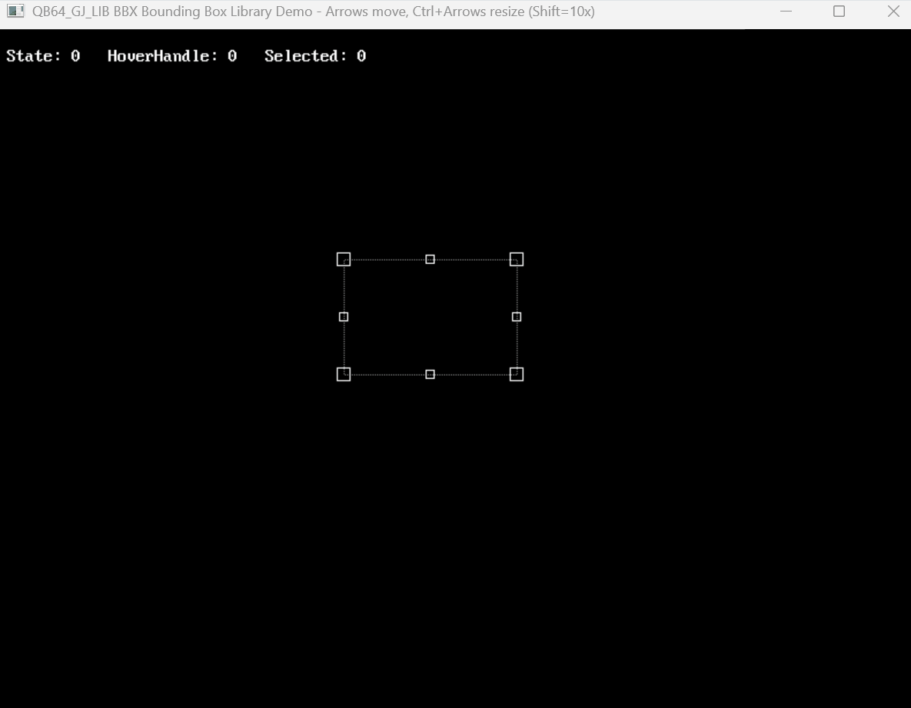

# [QB64_GJ_LIB](../README.md) 
## GRYMMJACK'S Bounding BOX (BBOX) LIBRARY

> This library provides a set of functions for creating and manipulating
> bounding boxes in QB64. This includes features like resizing, dragging,
> and handle management. 

### WHY?

The point of this is to have a simple bounding box UI element
which I can reuse for other projects. I often need a box and I 
often want to be able to resize it, drag it, etc. There are
common UX idioms present in Adobe Photoshop, GIMP, etc. that I
am used to. This preserves those idioms in a QB64PE context.

This library is designed to be easy to use and integrate into your QB64PE
projects by configuring, updating, and drawing from your own internal loops.

- Resizing is done by dragging the edges or corners of the bounding box. 
- Selecting a handle will change the mouse cursor and resize.
- Using arrow keys will move the box by `1px`.
- Holding `SHIFT` while using arrow keys will move the box by `10px`.
- Holding `CTRL` while using arrow keys will resize the box by `1px`.
- Holding `CTRL` + `SHIFT` while using arrow keys will resize the box by `10px`.

See the example and screenshot for more information. 


## WHAT'S IN THE LIBRARY
| SUB / FUNCTION | NOTES |
|----------------|-------|
| SUB GJ_BBX_InitDefaults () | Initialize with sane defaults |
| SUB GJ_BBX_InitWithConfig (cfg AS GJ_BBX_CFG) | Initialize with custom configuration (see GJ_BBX_CFG ) |
| SUB GJ_BBX_InitBox (x AS INTEGER, y AS INTEGER, w AS INTEGER, h AS INTEGER) | Initialize the box at position and size width/height |
| SUB GJ_BBX_Update () | Update the bounding box state |
| SUB GJ_BBX_Draw (showHUD AS INTEGER) | Draw the bounding box |
| SUB GJ_BBX_Tick (showHUD AS INTEGER) | This is a convenience SUB for updating and drawing the bounding box |

### USAGE for BBX LIB (separately)
```basic
'Insert at top of code:
'$INCLUDE:'path_to_GJ_LIB/BBX/BBX.BI'

'...your code here...
'From your loop / handler call GJ_BBX_Tick

'Insert at bottom of code:
'$INCLUDE:'path_to_GJ_LIB/BBX/BBX.BM'
```


### EXAMPLE 
> Screenshot of output from [BBX.BAS](BBX.BAS)

