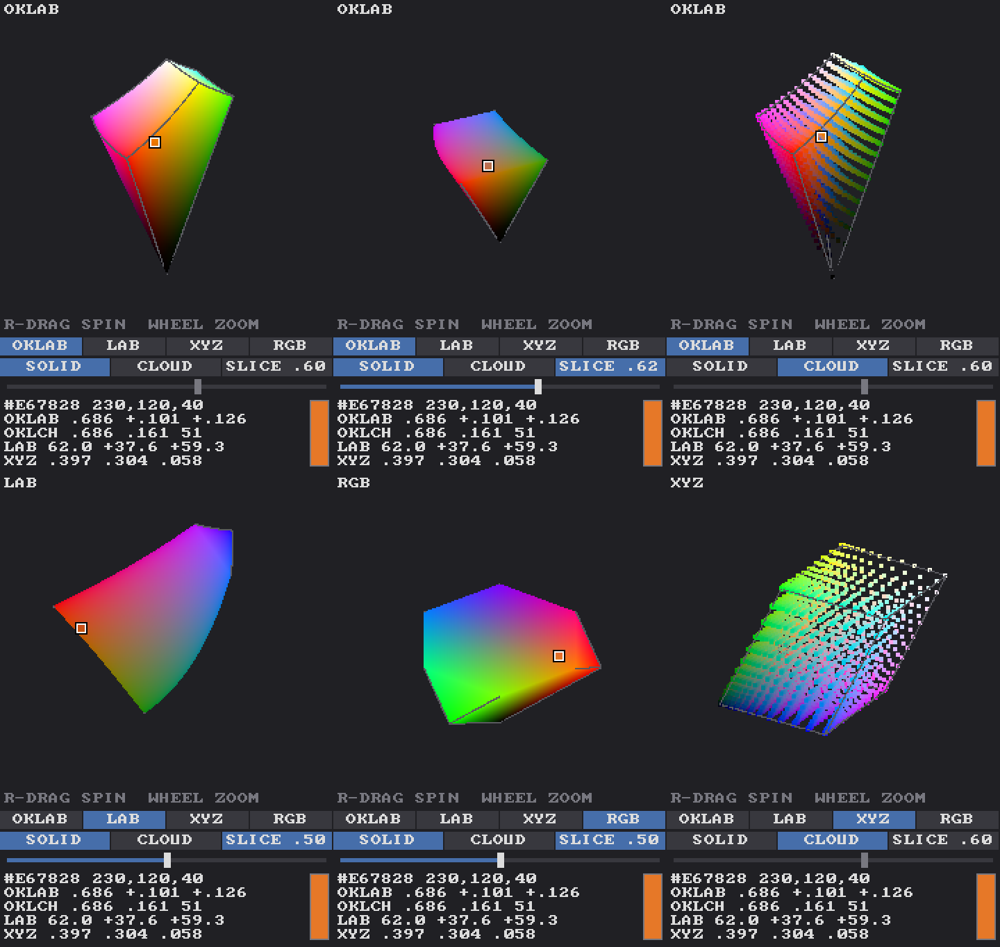

# QB64_GJ_LIB COLOR

Color science for QB64-PE, in three parts:

- **`COLOR-SPACES`** (`CLR_` prefix): conversions between sRGB, linear RGB, CIE XYZ,
  CIELAB / LCh and **OKLab / OKLCh**. Also gamut checks, gamut mapping by chroma
  reduction, perceptual (OKLab) and physically linear blending, and OKLCh lightness
  ramps. It is plain math with no graphics.
- **`COLOR-3D`** (`C3D_` prefix): a **rotatable 3D color picker**. It draws the sRGB
  gamut as a solid or a point cloud inside OKLab, CIELAB, XYZ or the RGB cube. You can
  spin and zoom it, cut it with a lightness slice, and click any visible color to pick
  it. Like the other GJ_LIB widgets, it renders into an offscreen image and reports
  picks through shared state.
- **`COLOR-PIGMENT`** (`PGM_` prefix): **paint-like pigment mixing** (Kubelka–Munk),
  a port of [Spectral.js](https://github.com/rvanwijnen/spectral.js). Blue + yellow
  makes green, as with real paint, instead of the gray you get from mixing light.

Built for [DRAW](https://github.com/grymmjack/DRAW), with no DRAW dependencies.



## Why OKLab?

sRGB numbers aren't spaced the way we see color. In plain RGB, a red→green blend
passes through a dark, muddy olive (`128,128,0`), and equal RGB steps look uneven.
OKLab (Björn Ottosson, 2020) is built so that distances match perceived differences:
the same red→green blend through OKLab passes through a clean yellow-orange
(`208,168,0`), and equal OKLab lightness steps look evenly spaced. OKLCh is its
polar form (lightness, chroma, hue), which suits pickers and ramps.

## COLOR-SPACES

```basic
'$INCLUDE:'COLOR/COLOR-SPACES.BI'
DIM AS SINGLE L, a, b, C, h
CLR_rgb32_to_oklab _RGB32(255, 0, 0), L, a, b      ' 0.628 0.225 0.126
CLR_rgb32_to_oklch _RGB32(255, 0, 0), L, C, h      ' 0.628 0.258 29.2
mid~& = CLR_mix_oklab~&(red~&, green~&, 0.5)       ' perceptual blend
col~& = CLR_oklch_to_rgb32~&(0.7, 0.2, 145)        ' gamut-mapped
DIM ramp(0 TO 7) AS _UNSIGNED LONG
CLR_oklch_ramp baseCol~&, 8, 0.2, 0.92, 20, 0.4, ramp()
'$INCLUDE:'COLOR/COLOR-SPACES.BM'
```

| Units | |
|---|---|
| sRGB | 0..255 integers, or gamma-encoded 0..1 floats |
| linear RGB | 0..1, no gamma |
| XYZ | D65, Y = 1 for white |
| CIELAB | L 0..100, a/b roughly ±128 (D65) |
| OKLab | L 0..1, a/b roughly ±0.4 |
| LCh | C ≥ 0, h in degrees |

Main routines:

| Routine | Does |
|---|---|
| `CLR_rgb32_to_linear` / `CLR_linear_to_rgb32~&` | sRGB transfer function |
| `CLR_linear_to_xyz` / `CLR_xyz_to_linear` | linear sRGB ↔ XYZ (D65) |
| `CLR_xyz_to_lab` / `CLR_lab_to_xyz` | XYZ ↔ CIELAB |
| `CLR_linear_to_oklab` / `CLR_oklab_to_linear` | linear sRGB ↔ OKLab |
| `CLR_lab_to_lch` / `CLR_lch_to_lab` | any Lab-like a/b ↔ chroma/hue |
| `CLR_rgb32_to_xyz` / `_lab` / `_oklab` / `_oklch` | 32-bit color in |
| `CLR_oklch_to_rgb32~&` / `CLR_oklab_to_rgb32~&` / `CLR_lab_to_rgb32~&` | back to 32-bit, gamut-mapped by chroma reduction (keeps L and h) |
| `CLR_xyz_to_rgb32~&` | back to 32-bit, clipped |
| `CLR_linear_in_gamut%` | inside sRGB? |
| `CLR_mix_oklab~&` / `CLR_mix_linear~&` | perceptual / physically linear blend (alpha blends linearly) |
| `CLR_oklch_ramp` | even dark→light ramp of a color's hue, with optional hue shift and chroma falloff toward the ends |

Outputs are `BYREF SINGLE`. Every routine copies its inputs first, so a call can reuse
the same variables for input and output.

`COLOR-SPACES-TEST.BAS` checks the math against published reference values (CSS Color 4
/ Ottosson for OKLab, D65 CIELAB, XYZ), round trips 4,096 colors through every space,
and tests gamut mapping, blends and ramps. It exits with code 1 on any failure.

## COLOR-3D

```basic
'$INCLUDE:'COLOR/COLOR.BI'             ' COLOR-SPACES + COLOR-3D
C3D_init initialColor~&, 240           ' native width; C3D_STATE.h is derived
DO
    C3D_input_mouse nx%, ny%, b1%, b2%, wheel%    ' widget-native coords
    IF C3D_STATE.changed THEN myColor~& = C3D_get_rgb~&
    C3D_render
    _PUTIMAGE (x, y), C3D_STATE.imgHandle
LOOP
C3D_cleanup
'$INCLUDE:'COLOR/COLOR.BM'
```

**Interaction**
- Left-click or left-drag on the solid picks colors.
- Left-drag on empty space, or right-drag anywhere, spins the view.
- The wheel zooms.

**Built-in controls** (below the view)
- Space buttons: OKLAB / LAB / XYZ / RGB.
- SOLID / CLOUD view toggle.
- SLICE toggle, plus a slider that cuts the solid at a lightness. The cut face shows
  every in-gamut color at that lightness, and all of them are pickable.
- Readouts in hex/RGB, OKLab, OKLCh, CIELAB and XYZ, for the hovered color (or the
  current one when not hovering), with a swatch.

**Host API:** `C3D_set_rgb` (syncs the marker to your current color), `C3D_get_rgb~&`,
`C3D_set_space`, `C3D_set_view`, `C3D_set_slice`, `C3D_set_rotation`,
`C3D_over_viewport%`, `C3D_set_font` (draw all text in a host font such as a
`_LOADFONT` TTF; the button rows, slider and readouts resize to fit it, so re-read
`C3D_STATE.h` afterwards — `0` restores the built-in 8x8), and theme colors in
`C3D_STATE` (`bgColor`, `textColor`, `dimColor`, `btnColor`, `btnOnColor`,
`btnHoverColor`, `btnTextColor`, `btnOnTextColor`, `sliderBgColor`,
`sliderEdgeColor`, `sliderFillColor`, `thumbColor`, `edgeColor`).

**How it works**

The surface is the six faces of the sRGB cube, mapped into the chosen space. Each space
is drawn at one uniform scale with its lightness axis vertical, so the shapes are true to
the space. The renderer rotates and projects orthographically, then rasterizes triangles
in software with a z-buffer (the same approach as qb64-dungeon's DICE3D software path).
It also keeps a **pick buffer** holding the exact color under every pixel, so you pick
exactly what you see.

The slice cap is solved per pixel: each pixel is unprojected onto the cut plane,
converted back to RGB, and kept only if it lands inside the gamut, which gives exact
edges. The view only re-rasterizes after it changes; otherwise `C3D_render` just
recomposes the image.

`COLOR-3D-TEST.BAS` is an interactive demo. `COLOR-3D-TEST --shot out.png SPACE VIEW SLICE
YAW PITCH` writes a single frame to a PNG (use an absolute path).

## COLOR-PIGMENT

```basic
'$INCLUDE:'COLOR/COLOR.BI'
g~& = PGM_mix~&(_RGB32(0, 33, 133), _RGB32(252, 211, 0), 0.5)   ' blue + yellow = green
t~& = PGM_mix_w~&(white~&, 3, red~&, 1)                          ' 3 parts white, 1 part red
'$INCLUDE:'COLOR/COLOR.BM'
```

Each color becomes a 38-band reflectance curve (380–750 nm), built from seven base
spectra (white, cyan, magenta, yellow, red, green, blue). That curve is turned into
Kubelka–Munk absorption/scattering (K/S). Mixing works like this:

- The K/S curves are averaged, weighted by **weight² × luminance**. Dark pigments are
  strong tinters, so a little blue goes a long way, as in real paint.
- The result is converted back to reflectance, then through the CIE observer to XYZ
  and sRGB.
- Out-of-gamut results are mapped back with Spectral.js's own OKLCh chroma search.
- Alpha blends linearly.
- K/S curves are cached per color (256 slots).

`COLOR-PIGMENT-TEST.BAS` (run from this folder, or pass the path) compares against the
307 reference mixes made by spectral.js in `COLOR-PIGMENT-REF.txt`; all match exactly. It exits with code 1 on any failure.

Spectral.js is MIT licensed, (c) 2025 Ronald van Wijnen. See `LICENSE-spectral.js.txt`.

(c) 2026 grymmjack — MIT License
