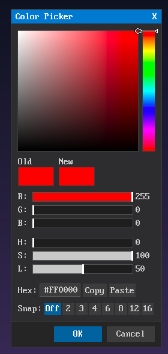
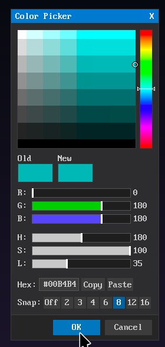

# COLOR_PICKER — Color Picker Dialog




> Photoshop/Krita-style modal color picker dialog for QB64-PE with dark flat theme.

## Features

- HSV square + vertical hue bar picker
- RGB sliders (R, G, B: 0-255) with colored tracks
- HSL sliders (H: 0-360, S: 0-100, L: 0-100)
- Hex input field (#RRGGBB) with Copy/Paste buttons
- Old/New color preview swatches (click old to revert)
- Posterize/Snap mode (Off, 2, 3, 4, 6, 8, 12, 16 levels) for pixel art
- Mouse wheel on SV square, hue bar, and sliders
- Shift+wheel for 10x step multiplier
- All color spaces stay in sync (HSV ↔ RGB ↔ HSL ↔ Hex)
- Draggable title bar, close [X] button
- Keyboard: Enter=OK, Escape=Cancel, Tab=hex input focus

## Dependencies

- **TEXT_INPUT** — Used for the hex input field

## Usage

```basic
'$INCLUDE:'path/to/COLOR_PICKER/COLOR-PICKER.BI'

' ... your code ...

DIM chosenColor AS _UNSIGNED LONG
chosenColor = CP_pick_color&("Pick a Color", _RGB32(255, 0, 0))
IF CP_STATE.result = CP_RESULT_OK THEN
    PRINT "Picked: R="; _RED32(chosenColor); " G="; _GREEN32(chosenColor); " B="; _BLUE32(chosenColor)
ELSE
    PRINT "Cancelled"
END IF

' With posterize pre-configured
CP_set_posterize 8
chosenColor = CP_pick_color&("", _RGB32(0, 180, 180))
CP_reset_options  ' clear for next use

'$INCLUDE:'path/to/COLOR_PICKER/COLOR-PICKER.BM'
```

## Files

| File | Purpose |
|------|---------|
| `COLOR-PICKER.BI` | Leader include |
| `COLOR-PICKER.BM` | Leader implementation |
| `CP-TYPES.BI` | Type definitions, drag target constants |
| `CP-THEME.BI` | Layout and color constants |
| `CP-API.BM` | Public API, color math (HSV/RGB/HSL), hex, init, modal loop |
| `CP-INPUT.BM` | Mouse/keyboard/wheel input, SV/hue/slider picking, posterize |
| `CP-RENDER.BM` | Dialog rendering (SV square, hue bar, sliders, preview, buttons) |
| `CP-TEST.BAS` | Standalone test program |

## API

| Function/Sub | Description |
|-------------|-------------|
| `CP_pick_color&(title$, initialColor~&)` | Show picker, returns chosen color |
| `CP_set_posterize(levels%)` | Pre-configure snap levels (0=off) |
| `CP_reset_options` | Reset all options to defaults |

### Color Math (public)

| Sub | Description |
|-----|-------------|
| `CP_hsv_to_rgb(h!, s!, v!, r%, g%, b%)` | HSV → RGB |
| `CP_rgb_to_hsv(r%, g%, b%, h!, s!, v!)` | RGB → HSV |
| `CP_rgb_to_hsl(r%, g%, b%, h!, s!, l!)` | RGB → HSL |
| `CP_hsl_to_rgb(h%, s!, l!, r%, g%, b%)` | HSL → RGB |

## Author

grymmjack (Rick Christy) — MIT License
