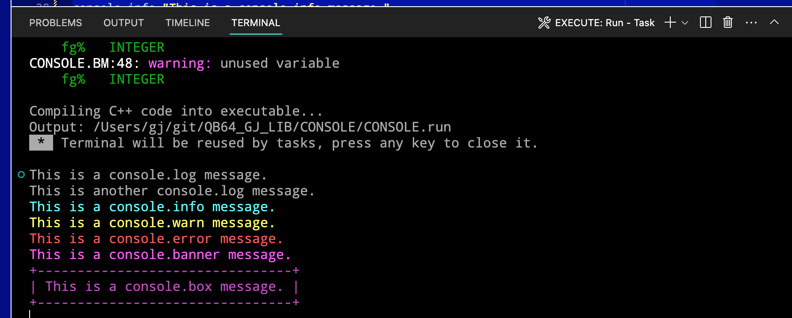

# [QB64_GJ_LIB](../README.md) 
## GRYMMJACK'S CONSOLE LIBRARY

> CONSOLE object with debugging.

The idea of this library and is to provide a elegant and simple way to include
console output conditionally by setting one `$LET DEBUGGING = TRUE` in your code
and if you do not have this set, just including the library will enable it by
default. This will let you simply include the library and get busy using it. 

So what does it do? Well it provides QB64PE with functions similar to that of
a web developer is spoiled by with a console object to use. 

In this case, we simply send strings to the console terminal of various colors
with ANSI codes.

I've extended the original idea of the web console.log a bit with a banner, and
a box utility which is handy for seeing output separated from the rest. 

See the example and screenshot for more information. 


## WHAT'S IN THE LIBRARY
| SUB / FUNCTION | NOTES |
|----------------|-------|
| CONSOLE.log | Log to console if DEBUGGING |
| CONSOLE.info | Log to console as info if DEBUGGING |
| CONSOLE.warn | Log to console as warning if DEBUGGING |
| CONSOLE.error | Log to console as error if DEBUGGING |
| CONSOLE.banner | Log a banner to console if DEBUGGING |
| CONSOLE.box | Log a boxed message to console if DEBUGGING |


### USAGE for CONSOLE LIB (separately)
```basic
'Insert at top of code:
'$INCLUDE:'path_to_GJ_LIB/CONSOLE/CONSOLE.BM'

'...your code here...

'Insert at bottom of code:
'$INCLUDE:'path_to_GJ_LIB/CONSOLE/CONSOLE.BM'
```


### EXAMPLE 
> Screenshot of output from [CONSOLE.BAS](CONSOLE.BAS)

