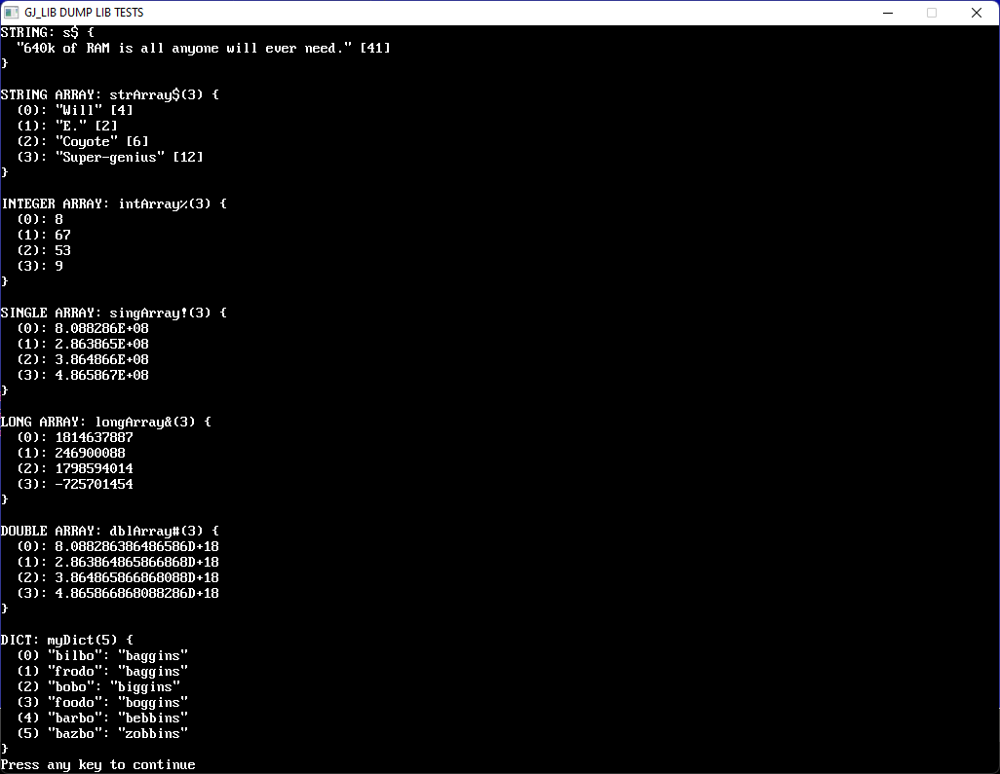

# [QB64_GJ_LIB](../README.md)
## GRYMMJACK'S DUMP LIBRARY

Dumps variables in a human friendly way to assist in debugging.
Inspired by PHP [print_r()](https://www.php.net/manual/en/function.print-r.php) which I missed when writing in QB64.


## WHAT'S IN THE LIBRARY
| FUNCTION | NOTES |
|----------|-------|
| DUMP.bit_array$                     | Returns string with a dump of an array of bits |
| DUMP.unsigned_bit_array$            | Returns string with a dump of an array of unsigned bits |
| DUMP.byte_array$                    | Returns string with a dump of an array of bytes |
| DUMP.unsigned_byte_array$           | Returns string with a dump of an array of unsigned bytes |
| DUMP.unsigned_integer$              | Returns string with a dump of an array of unsigned integers |
| DUMP.unsigned_byte_array_as_hex$    | Returns string with a dump of an array of unsigned bytes as hex |
| DUMP.unsigned_byte_array_as_ascii$  | Returns string with a dump of an array of unsigned bytes as hex and ASCII |
| DUMP.string$                        | Includes handy output of the strings length. |
| DUMP.string_array$                  | Works on 1 dimensional arrays only (right now). |
| DUMP.integer_array$                 | Works on 1 dimensional arrays only (right now). |
| DUMP.single_array$                  | Works on 1 dimensional arrays only (right now). |
| DUMP.long_array$                    | Works on 1 dimensional arrays only (right now). |
| DUMP.double_array$                  | Works on 1 dimensional arrays only (right now). |
| DUMP.dict$                          | Dump a dictionary object and it's contents. |


## So, why "[dump](https://www.merriam-webster.com/dictionary/dump)"?
```
 [0] dump: 
       to copy (data in a computer's internal storage) to an external storage 
       or output device
          ^^^^^^^^^^^^^ 
               this
```


### GUIDELINES
> Every function returns a string called a dump block. I chose to return a string that you can print or do whatever you want with instead of just PRINT because PRINT isn't always what we want when debugging. The idea is that You can then PRINT the string in your code where you need to see what vars have inside them quickly.

#### A dump block consists of:
 - A blank line
 - The type of variable being dumped
 - The number of elements in an array (if applicable)
 - A label for reference

_Here is an example of a dump of a string array:_
```basic
DIM words$(2)
words$(0) = "foo" : words$(1) = "bar" : words$(2) = "baz"
PRINT DUMP.string_array(words$(), "words")
```

_output:_
```
STRING ARRAY: words$(2) {
    (0): "foo" [3]
    (1): "bar" [3]
    (2): "baz" [3]
}
```


### USAGE for DUMP LIB (separately)
```basic
'Insert at top of code:
'$INCLUDE:'path_to_GJ_LIB/DUMP/DUMP.BI'

'...your code here...

'Insert at bottom of code:
'$INCLUDE:'path_to_GJ_LIB/DUMP/DUMP.BM'
```


## NOTE
Because QB64 lacks any reflection support, has no way to pass an optional
argument, has no ability to identify a variable type, or even `eval()` its
own dialect, there are separate functions for each common type. If you don't
see the one you need, it's easy enough to copy an existing one and make what
you want while staying in the spirit of DUMP LIB.


### EXAMPLE 
> Screenshot of output from [DUMP.BAS](DUMP.BAS)

