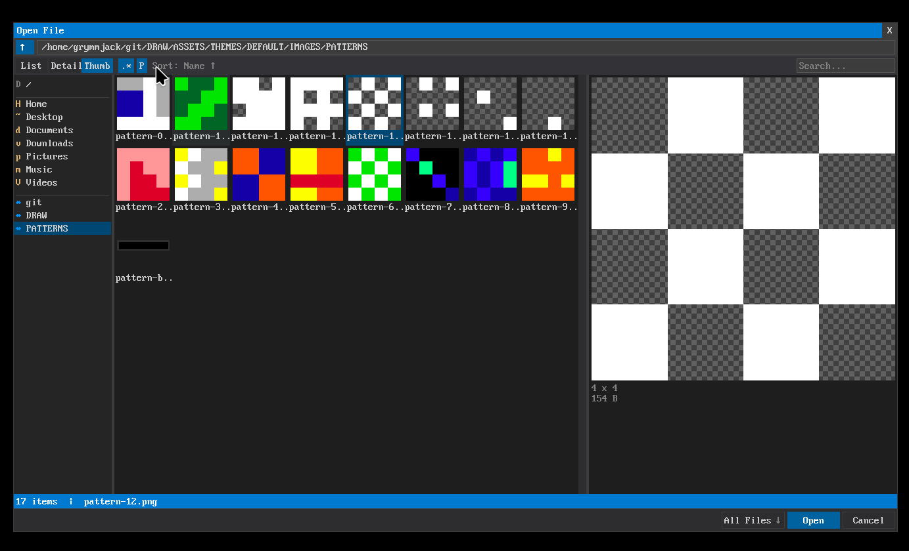
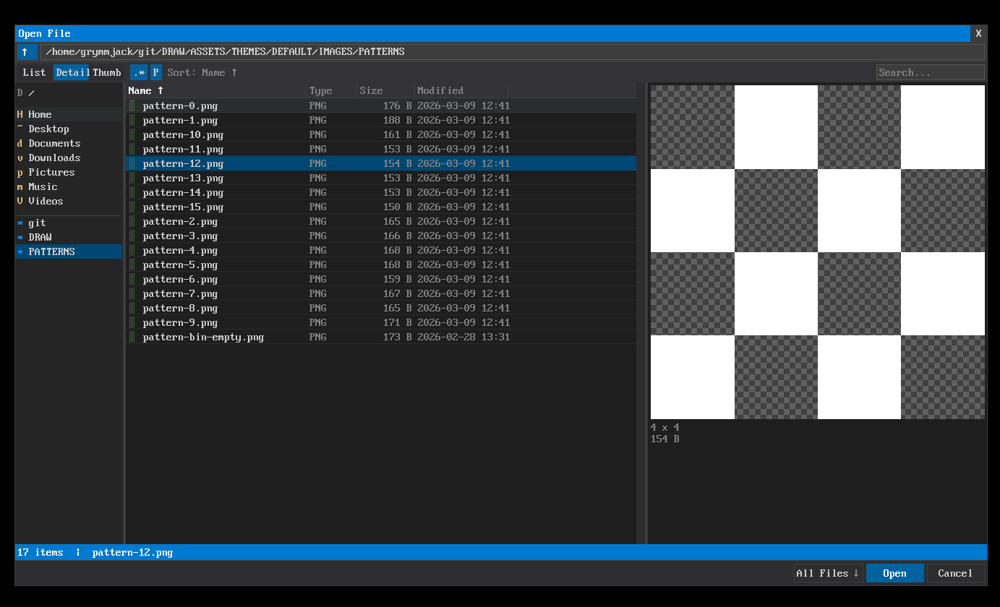
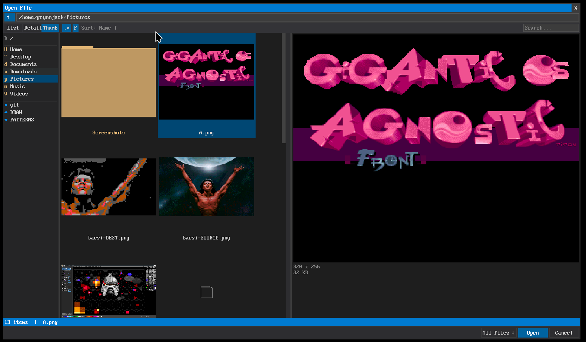

# FILE_DIALOG — Custom File Dialog





> Full-featured cross-platform file dialog for QB64-PE with dark flat theme, thumbnail preview, and places bar.

## Features

- **4 modes**: Open File, Save File, Save As, Choose Folder
- **3 view modes**: List, Details (size/date columns), Thumbnails
- Filter by extension (`*.bmp;*.png;*.jpg;...`)
- Multi-column sort (Name, Size, Date) — click header, Shift+click secondary
- Places bar (Home, Desktop, Documents, Pictures, Recent, Drives)
- Image thumbnail generation and caching
- Inline rename (F2), new folder (Ctrl+N), delete (Delete key)
- Path breadcrumb bar + text input toggle
- File-name text input with auto-complete
- Keyboard: Enter=select, Escape=cancel, Backspace=parent, Tab=cycle focus
- Mouse double-click to open, right-click (reserved), scroll bar, resize
- Platform-native C interop for home dir, drives, file stats, thumbnails

## Dependencies

- **TEXT_INPUT** — Used for filename and path input fields
- **filedialog_platform.h** — C header for OS-level file operations (included)

## Usage

```basic
'$INCLUDE:'path/to/FILE_DIALOG/FILE-DIALOG.BI'

' ... your code ...

' Open a file
DIM result AS STRING
result = FD_open_file$("Open Image", "*.bmp;*.png;*.jpg", "/home/user/Pictures")
IF LEN(result) > 0 THEN
    PRINT "Opened: "; result
END IF

' Save a file
result = FD_save_file$("Save Image", "*.bmp", "/home/user/Pictures", "untitled.bmp")
IF LEN(result) > 0 THEN
    PRINT "Saving to: "; result
END IF

' Choose a folder
result = FD_choose_folder$("Select Folder", "/home/user")
IF LEN(result) > 0 THEN
    PRINT "Folder: "; result
END IF

'$INCLUDE:'path/to/FILE_DIALOG/FILE-DIALOG.BM'
```

## Files

| File | Purpose |
|------|---------|
| `FILE-DIALOG.BI` | Leader include |
| `FILE-DIALOG.BM` | Leader implementation |
| `FD-TYPES.BI` | Type definitions, mode/view/sort constants |
| `FD-THEME.BI` | Layout and color constants |
| `FD-PLATFORM.BI` | C function declarations (DECLARE LIBRARY) |
| `FD-PLATFORM.BM` | Platform helpers (drives, home dir, file attributes) |
| `FD-FS.BM` | File system navigation, directory listing, extension filter |
| `FD-THUMB.BI` | Thumbnail cache types |
| `FD-THUMB.BM` | Thumbnail generation and cache management |
| `FD-RENDER.BM` | Dialog rendering (list/details/thumbnail views, places, header) |
| `FD-INPUT.BM` | Mouse/keyboard input, navigation, selection, drag |
| `FD-API.BM` | Public API wrappers, init, layout, modal loop |
| `FD-TEST.BAS` | Standalone test program |
| `filedialog_platform.h` | C interop header (stat, readdir, home dir, drives) |

## API

| Function/Sub | Description |
|-------------|-------------|
| `FD_open_file$(title$, filter$, startDir$)` | Open file dialog |
| `FD_save_file$(title$, filter$, startDir$, defaultName$)` | Save file dialog |
| `FD_save_as_file$(title$, filter$, startDir$, defaultName$)` | Save-as dialog |
| `FD_choose_folder$(title$, startDir$)` | Folder chooser dialog |

### View/Sort Configuration

| Sub | Description |
|-----|-------------|
| `FD_set_view_mode(mode%)` | Set view: `FD_VIEW_LIST`, `FD_VIEW_DETAILS`, `FD_VIEW_THUMBNAILS` |
| `FD_set_sort_column(col%)` | Set sort: `FD_SORT_NAME`, `FD_SORT_SIZE`, `FD_SORT_DATE` |

## Platform Notes

The C header `filedialog_platform.h` provides cross-platform access to:
- Home directory detection (Linux: `$HOME`, Windows: `%USERPROFILE%`)
- Drive enumeration (Windows: `GetLogicalDrives`, Linux: `/mnt` + `/media`)
- File metadata (`stat()` for size, modification time)
- Directory reading (`opendir`/`readdir`)
- Thumbnail extraction (stub — extend for OS-specific APIs)

## Author

grymmjack (Rick Christy) — MIT License
