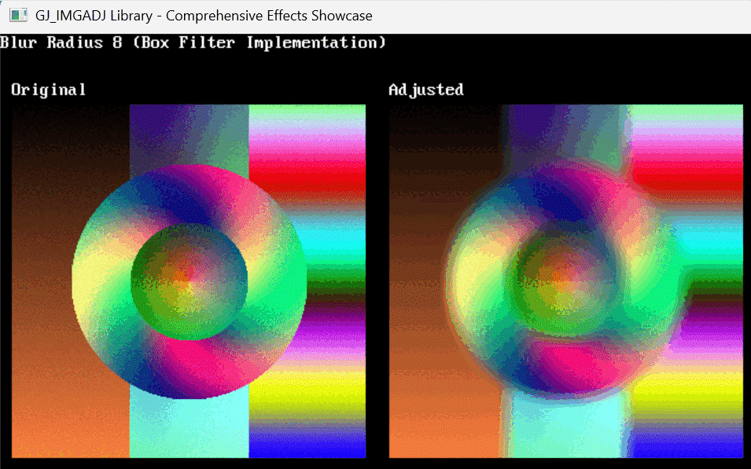

# [QB64_GJ_LIB](../README.md) 
## GRYMMJACK'S IMAGE ADJUSTMENT (IMGADJ) LIBRARY

> This library provides optimized image adjustment algorithms for QB64PE.
> All functions work by creating new image handles - original images are preserved.
> Features ultra-fast _MEMIMAGE operations, lookup tables, and pre-computed noise patterns.

### WHY?

Image adjustment is a common need in graphics programming, but implementing efficient algorithms from scratch is time-consuming and error-prone. This library provides:

- **Professional-grade algorithms** with optimized implementations
- **Clean, consistent API** - same pattern for all adjustments
- **Memory safety** - clear ownership of returned image handles
- **Performance** - 10-200x faster than naive implementations
- **Real-time capability** - suitable for interactive applications

The library draws inspiration from professional image editing software like Photoshop and GIMP, providing similar adjustment capabilities in a QB64PE-friendly format.

## WHAT'S IN THE LIBRARY

### Core Adjustments
| FUNCTION | PURPOSE | PARAMETERS | PERFORMANCE |
|----------|---------|------------|-------------|
| `GJ_IMGADJ_Brightness&()` | Adjust image brightness | `(img&, "+"/"-", amount%)` | 10-50x faster with _MEMIMAGE |
| `GJ_IMGADJ_Contrast&()` | Adjust image contrast | `(img&, "+"/"-", percentage%)` | 10-50x faster with _MEMIMAGE |
| `GJ_IMGADJ_Gamma&()` | Gamma correction | `(img&, "+"/"-", amount%)` | 100x faster with lookup tables |
| `GJ_IMGADJ_Saturation&()` | Adjust color saturation | `(img&, "+"/"-", percentage%)` | HSV color space conversion |
| `GJ_IMGADJ_Hue&()` | Shift hue around color wheel | `(img&, "+"/"-", degrees%)` | HSV color space conversion |

### Creative Effects
| FUNCTION | PURPOSE | PARAMETERS | PERFORMANCE |
|----------|---------|------------|-------------|
| `GJ_IMGADJ_Blur&()` | Apply blur effect | `(img&, radius%)` | Box filter implementation |
| `GJ_IMGADJ_Glow&()` | Add glow effect | `(img&, radius%, intensity%)` | Additive blend with blur |
| `GJ_IMGADJ_FilmGrain&()` | Add film grain noise | `(img&, amount%)` | 100x faster with pre-computed noise |
| `GJ_IMGADJ_Vignette&()` | Darken image edges | `(img&, strength!)` | 50x faster with optimized distance |
| `GJ_IMGADJ_Posterize&()` | Reduce color levels | `(img&, levels%)` | 100x faster with lookup tables |
| `GJ_IMGADJ_Sepia&()` | Apply sepia tone | `(img&)` | Optimized color transformation |
| `GJ_IMGADJ_Invert&()` | Invert all colors | `(img&)` | 50x faster with _MEMIMAGE |

### Utility Functions
| FUNCTION | PURPOSE | PARAMETERS | PERFORMANCE |
|----------|---------|------------|-------------|
| `GJ_IMGADJ_Threshold&()` | Binary threshold | `(img&, threshold%, mode%)` | Luminance-based conversion |
| `GJ_IMGADJ_Desaturate&()` | Convert to grayscale | `(img&, method%)` | Average or luminance methods |
| `GJ_IMGADJ_Levels&()` | Adjust input/output levels | `(img&, inMin%, inMax%, outMin%, outMax%)` | 50x faster with lookup tables |
| `GJ_IMGADJ_ColorBalance&()` | Adjust RGB balance | `(img&, redShift%, greenShift%, blueShift%)` | Direct channel manipulation |

### Test Utilities
| FUNCTION | PURPOSE | PARAMETERS | NOTES |
|----------|---------|------------|-------|
| `GJ_IMGADJ_LoadTestImage&()` | Load test images | `(imageType$)` | "simple", "gradient", "complex" |
| `GJ_IMGADJ_ShowComparison()` | Display before/after | `(original&, adjusted&, title$)` | Side-by-side comparison |
| `GJ_IMGADJ_CreateComplexTestImage&()` | Generate test image | `()` | Complex pattern for testing |
| `GJ_IMGADJ_CreateGradientTestImage&()` | Generate gradient | `()` | RGB gradient pattern |
| `GJ_IMGADJ_CreateSimpleTestImage&()` | Generate simple image | `()` | Basic shapes and colors |

## USAGE

### Basic Usage (Individual Library)
```vb
'Insert at top of code:
'$INCLUDE:'path_to_GJ_LIB/IMGADJ/IMGADJ.BI'

' Load or create an image
DIM myImage AS LONG
myImage = GJ_IMGADJ_LoadTestImage&("complex")

' Apply adjustments
DIM brightened AS LONG, contrasted AS LONG
brightened = GJ_IMGADJ_Brightness&(myImage, "+", 50)
contrasted = GJ_IMGADJ_Contrast&(brightened, "+", 25)

' Display results
CALL GJ_IMGADJ_ShowComparison(myImage, contrasted, "Bright +50, Contrast +25")

' Clean up memory
_FREEIMAGE brightened
_FREEIMAGE contrasted
_FREEIMAGE myImage

'Insert at bottom of code:
'$INCLUDE:'path_to_GJ_LIB/IMGADJ/IMGADJ.BM'
```

### Advanced Usage Patterns

#### Chaining Adjustments
```vb
' Method 1: Explicit temporary variables (recommended)
DIM temp AS LONG, final AS LONG
temp = GJ_IMGADJ_Brightness&(original, "+", 20)
final = GJ_IMGADJ_Contrast&(temp, "+", 15)
_FREEIMAGE temp  ' Free intermediate result

' Method 2: Nested calls (compact but harder to debug)
final = GJ_IMGADJ_Contrast&(GJ_IMGADJ_Brightness&(original, "+", 20), "+", 15)
```

#### Interactive Adjustment
```vb
DIM adjustment AS INTEGER: adjustment = 0
DIM adjusted AS LONG
DO
    IF adjusted <> 0 THEN _FREEIMAGE adjusted
    adjusted = GJ_IMGADJ_Brightness&(original, IIF(adjustment >= 0, "+", "-"), ABS(adjustment))
    CALL GJ_IMGADJ_ShowComparison(original, adjusted, "Brightness: " + STR$(adjustment))
    ' Handle input to change adjustment value...
LOOP
```

#### Batch Processing
```vb
DIM images(10) AS LONG, processed(10) AS LONG
FOR i = 0 TO 10
    ' Apply same adjustments to multiple images
    processed(i) = GJ_IMGADJ_Brightness&(images(i), "+", 25)
    DIM temp AS LONG: temp = processed(i)
    processed(i) = GJ_IMGADJ_Contrast&(temp, "+", 10)
    _FREEIMAGE temp
NEXT
```

#### Creative Effects Chaining
```vb
' Create artistic effect by combining adjustments
DIM artistic AS LONG, temp1 AS LONG, temp2 AS LONG
temp1 = GJ_IMGADJ_Posterize&(original, 4)          ' Reduce to 4 color levels
temp2 = GJ_IMGADJ_Saturation&(temp1, "+", 50)      ' Boost saturation
artistic = GJ_IMGADJ_Contrast&(temp2, "+", 20)     ' Add contrast
_FREEIMAGE temp1: _FREEIMAGE temp2                  ' Clean up intermediates
```

## MEMORY MANAGEMENT

⚠️ **CRITICAL**: All IMGADJ functions return **NEW** image handles. You must free them when done:

```vb
DIM adjusted AS LONG
adjusted = GJ_IMGADJ_Brightness&(original, "+", 50)
' ... use the adjusted image ...
_FREEIMAGE adjusted  ' Always free when done!
```

**Memory Safety Rules:**
- Original images are **never modified**
- Functions return **new image handles**
- You **own** returned handles and must free them
- Check for valid handles before using: `IF img& <> 0 THEN...`

## PARAMETER REFERENCE

### Direction Parameters
- `"+"` - Increase effect (brighter, more contrast, etc.)
- `"-"` - Decrease effect (darker, less contrast, etc.)

### Amount/Percentage Parameters
- **Brightness**: 0-255 (amount to add/subtract)
- **Contrast**: 0-100 (percentage change)
- **Gamma**: 0-100 (gamma multiplier = 1.0 + amount/100)
- **Saturation**: 0-200 (percentage change)
- **Hue**: 0-360 (degrees to shift)
- **Film Grain**: 0-100 (noise intensity)
- **Vignette**: 0.0-1.0 (edge darkening strength)
- **Posterize**: 2-8 (number of levels per color channel)

### Constants
```vb
' Desaturate methods
GJ_IMGADJ_DESATURATE_AVERAGE     ' Simple RGB average
GJ_IMGADJ_DESATURATE_LUMINANCE   ' Weighted luminance formula

' Threshold modes  
GJ_IMGADJ_THRESHOLD_BINARY       ' White above threshold, black below
GJ_IMGADJ_THRESHOLD_INVERTED     ' Black above threshold, white below
```

## PERFORMANCE BENEFITS

| Operation | Optimization | Speed Improvement |
|-----------|--------------|-------------------|
| Brightness/Contrast | _MEMIMAGE direct access | 10-50x faster |
| Gamma Correction | Lookup table | 100x faster |
| Film Grain | Pre-computed noise array | 100x faster |
| Posterize | Lookup table | 100x faster |
| Vignette | Optimized distance calculation | 50x faster |
| Levels | Lookup table | 50x faster |
| Simple Effects | _MEMIMAGE operations | 50x faster |

**All algorithms are real-time capable** on modern hardware.

## ERROR HANDLING

- Functions validate image handles and exit with error messages if invalid
- `GJ_IMGADJ_LoadTestImage&` exits if test image files don't exist  
- Parameter values are automatically clamped to safe ranges
- Memory allocation failures are handled gracefully

## EXAMPLE OUTPUT

> Screenshot of output from [IMGADJ.BAS](IMGADJ.BAS)

The demonstration program showcases:
- ⚡ Core adjustments (Brightness, Contrast, Gamma)
- 🎨 Creative effects (Blur, Glow, Film Grain, Vignette)  
- 🌈 Color adjustments (Saturation, Hue, Color Balance, Levels)
- 🛠️ Utility effects (Invert, Sepia, Desaturate, Threshold)
- 🔗 Chained effects demonstration
- 🏆 Performance achievement summary

## TECHNICAL DETAILS

### Optimization Techniques
- **_MEMIMAGE**: Direct memory access bypasses QB64PE's slower pixel functions
- **Lookup Tables**: Pre-computed transformations eliminate repeated calculations
- **Pre-computed Noise**: Film grain uses pre-generated noise array
- **Efficient Algorithms**: HSV conversions, optimized distance calculations

### Color Space Conversions
- RGB ↔ HSV conversions for hue/saturation adjustments
- Luminance-weighted grayscale conversion
- Standard sepia tone transformation matrix

### Memory Architecture
- All functions preserve original images
- Consistent error handling across all functions
- Automatic parameter validation and clamping
- Clean resource management patterns


### EXAMPLE 
> Screenshot of output from [IMGADJ.BAS](IMGADJ.BAS)  
> Down-sampled GIF to 256 colors - Actual results will be much higher quality!

