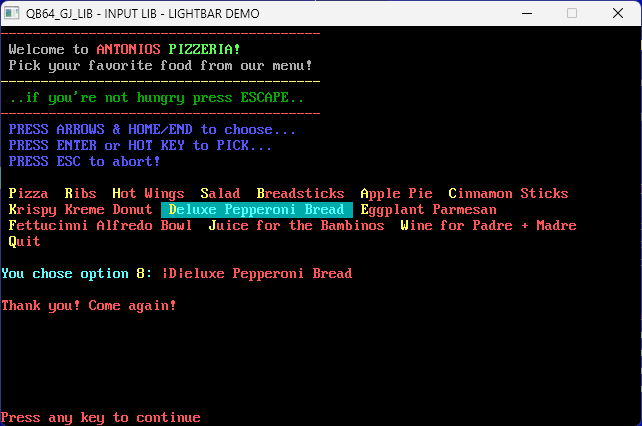
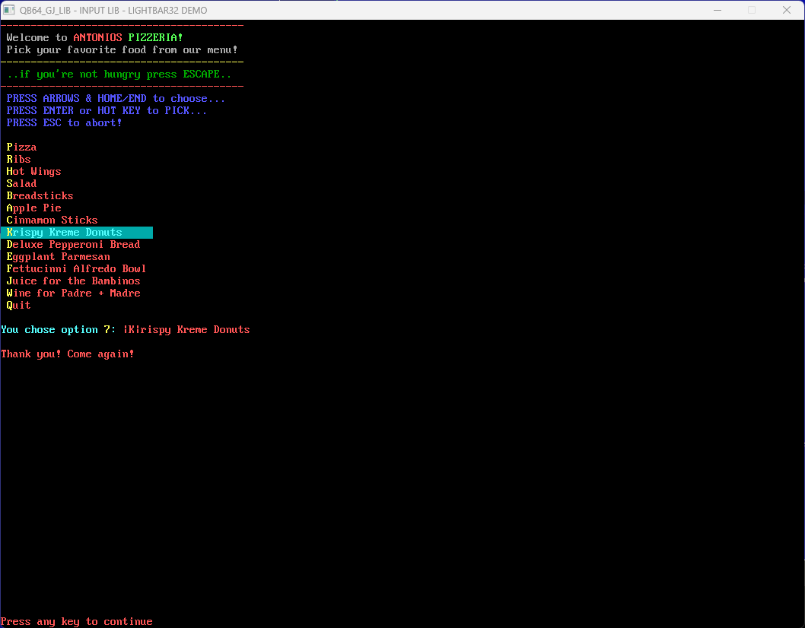

# [QB64_GJ_LIB](../README.md)
## GRYMMJACK'S INPUT LIBRARY
> NOTE: QB64PE v3.8.0+ Required (SOUND updates)


## WHAT'S IN THE LIBRARY
| MODULE | NOTES |
|--------|-------|
| [LIGHTBAR.BAS](LIGHTBAR.BAS) | A reusable modular lightbar menu (SCREEN 0)|
| [LIGHTBAR32.BAS](LIGHTBAR32.BAS) | A reusable modular lightbar menu (RGB32) |


### THINGS I WANT TO ADD (in order of preference/usefulness)
- [ ] **Individual colors per option** 
    - Use default if not set in individual options
- [ ] **Individual sounds for pick sound** 
    - Use default if not set in individual options
- [ ] **Non-hot key mode**
    - Technically, this already works if we do not use delimiters and put an extra space in front of the option `.txt`
    - Just want to make the option official and add documentation
- [ ] **Make arrows more intuitive** 
    - So up and down arrows only work when in vertical orientation or when applicable
    - If run out of space to draw options vertically against _SCREENHEIGHT, stack to make another column to the right side and allow left and right arrows to go move between vertical column stacks.
        - Same true for horizontal where if multiple rows are drawn then allow the use of the up and down arrows to go to the option above or below
            - Use logical math like - if many rows from wrap, and selected option has a row above or below it, and if the option is longer in width and width of selected option could logically move to several options above or below, make the choice based on the ceter-most or left-most option.
            ```
            foo bar1 baz1 bop1 foo2 bar2 baz2 bop foo bar baz bop foo 
            bar [battlestar-baztastica-9000] bop foo bar baz bop 

            [] = selected option

            the available candidates for moving up are:
            - bar1 baz1 bop1 foo1 bar2 baz2
            - but as a human i would expect either bop1 or foo1 to be where my selection moves
            - when tied for center, use center-most left side 
                - in example above, that would be bop1

            foo bar1 baz1 bop1 foo2 bar2 baz bop foo bar baz bop foo 
            bar [battlestar-baztastica] bop foo bar baz bop 

            [] = selected option
            
            the available candidates for moving up are:
            - bar1 baz1 bop1 foo1 bar2
            - but as a human i would expect either bop1 to be where my selection moves
            - center is almost absolute
                - in example above, 
                    - left side of selected option has 9 chars
                    - right side of selected option has 8 chars
                    - bop1 is 9 characters from the leftmost side of selected option

            foo cylon-base-star baz1 bop1 foo2 bar2 baz bop foo bar baz bop foo 
            bar [battlestar-baztastica] bop foo bar baz bop 

            the available candidates for moving up are:
            - cylon-base-star baz1
            - but as a human i would expect cylon-base-star to be where my selection moves
            - center is not absolute center
                - logic = 
                    1. find options above current selected option as move candidates
                    2. weight move candidates based on option length
                    3. longer options get more weight
                    4. move to the weightiest
                    5. if duplicate weights exist, to break ties use move candidate closest to selected options center.
            ```
- [ ] **Random choice select**
    - In this way interest can be gained. Imagine you don't care which option a user chooses, but you want it to be chance based. Why would you want this? Users who are playing a game where chance is a factor will get into the habit of hotkey sequencing. Imagine you are in a combat, and you want to fight, and the foes you want to choose from are in a lightbar menu. BUT your characters composure is impacted negatively so he is in fight-or-flight mode, and thus his own actions would be a little chaotic and random. We can simulate this with our random choice option. Picking a foe to fight in the list of foes for targetting an attack being random makes the player have to slow down and take a deep breath -- what if you target the foe your previous party member targetted and likelihood is high that the monster will be dead when it's your turn to attack? ... aha! gotcha. you just swung at the air! next time don't be so confident...
    - In this mode, hot keys should be skipped.    
- [ ] **Slot machine select** 
    - Imagine the Price is Right game show wheel.
    - In this mode, hot keys should be skipped.    
    - While the lightbar menu isn't a wheel, it could spin by automatically moving the selected option through a linear sequence.
        - Args for this could be
            - speed: at which the options animate
            - friction: at which the options finally come to a stop. lower friction = longer spin time.
            - easing-start function to make wheel bar feel heavy or light
            - easting-end function
            - user_activated_spin: true/false - if false automatic spin happens, otherwise activation key needs to be pressed to engage.
            - user_activated_stop: true/false - if false spin only stops when user presses activation key to stop.
            - spin_activation_keycode: key used to initiate the spin
            - stop_activation_keycode: key used to stop the spin
- [ ] **Auto move with a speed option** 
    - Here is another idea where the lightbar selection movement could be chaotic
    - In this mode, hot keys should be skipped.
    - Choosing options in ways like:
        - Random - complete chaos
        - Semi-random - random 1 time, then neighbor options n+/- selected option x times, repeat
        - Weighted random - options can have weights when the weight is higher, it is more likely to be chosen.
    - This could be used for simple games. Like the menu draws, but it moves at speed on it's own and the user can only hit the activation keycode (no arrow keys to navigate, etc.) for elements of chance. 
- [ ] **pipeprint support** for option text
    - So that options can be super fancy with multiple colors and formatting through `pipeprint`
- [ ] **adjacent selector support**
    - Easier to show with example, but, options are presented just like they normally would be but instead of a bar simulating movement and selection changing colors, a text string chooses instead:
        ```
        example: -> is the text string chooser.

            Pick which vegetable you want on your cheese burger:

         -> Onion
            Tomato
            Pickle
            Lettuce

        ```
    - Possible options:
        - txt_chooser_left:
            - left side text
        - txt_chooser_right:
        - chooser_type: left, right, wrap

## HOW TO USE LIGHTBAR

> First things first, there are 2 separate LIGHTBAR modules; a SCREEN 0 text
> version, and a 32bit BPP version.

### TL;DR: The bare-bones example:
```basic
'$INCLUDE:'LIGHTBAR.BI'
_BLINK OFF
DIM menu AS LIGHTBAR
DIM options(1) AS LIGHTBAR_OPTION
DIM choice AS INTEGER
menu.opt_bg_color% = 0  : menu.opt_fg_color% = 12 ' Unselected option colors
menu.bar_bg_color% = 3  : menu.bar_fg_color% = 11 ' Selected option colors
menu.bar_kf_color% = 14 : menu.bar_kb_color% = 3  ' Selected hot key colors
menu.key_bg_color% = 0  : menu.key_fg_color% = 14 ' Unselected hot key colors
menu.opt_vertical% = 0
menu.delimeter$ = "|"
menu.max_width% = _WIDTH(0)
options(0).txt = " |Y|es "
options(1).txt = " |N|o "
PRINT "Hey, is this neat or what? ";
choice% = LIGHTBAR%(menu, options())
LOCATE 2, 1
IF choice% = 0 THEN PRINT "IKR!?"
IF choice% = 1 THEN PRINT "Pffft! whatever..."
'$INCLUDE:'LIGHTBAR.BM'
```

### Setup for LIGHTBAR (either version)
1. Include in your project before any other code `LIGHTBAR.BI` at the top
2. Include in your project after all other code `LIGHTBAR.BM` at the bottom
3. Create your menu choices as an array of strings
4. In each menu choice use a common delimiter for your hot keys (if you like)
5. Insert `DIM menu AS LIGHTBAR` (or LIGHTBAR32 if using RGB32 one)
6. Configure your `menu` LIGHTBAR (see below)
7. Insert `DIM options(3) AS LIGHTBAR_OPTION` (or LIGHTBAR32_OPTION...)
8. Position your cursor where you want the menu to start
9. Insert `choice% = LIGHTBAR%(menu, opts$(), options())`
10. Which option user picked will be an INTEGER in choice% according to array

#### LIGHTBAR Configuration
> NOTE: Colors are INTEGERS to be compatible with SCREEN 0 mode
```basic
opt_bg_color AS INTEGER ' Unselected background color
opt_fg_color AS INTEGER ' Unselected foreground color
bar_bg_color AS INTEGER ' Selected background color
bar_fg_color AS INTEGER ' Selected foreground color
bar_kf_color AS INTEGER ' Selected hot key foreground color
bar_kb_color AS INTEGER ' Selected hot key background color
key_bg_color AS INTEGER ' Unselected hot key background color
key_fg_color AS INTEGER ' Unselected hot key foreground color
opt_selected AS INTEGER ' Selected option index
opt_vertical AS INTEGER ' 1 = true (then vertical) 0 = false (then horiz)
max_width    AS INTEGER ' Maximum width for horizontal options
delimeter    AS STRING  ' Single character used to surround hot key
use_sounds   AS INTEGER ' 1 = true (use sounds) 0 = false (no sounds)
snd_move_frq AS SINGLE  ' Frequency for SOUND movement
snd_move_dur AS SINGLE  ' Duration for SOUND movement
snd_move_vol AS SINGLE  ' Volume for SOUND movement
snd_pick_frq AS SINGLE  ' Frequency for SOUND pick
snd_pick_dur AS SINGLE  ' Duration for SOUND pick
snd_pick_vol AS SINGLE  ' Volume for SOUND pick
snd_abrt_frq AS SINGLE  ' Frequency for SOUND pick
snd_abrt_dur AS SINGLE  ' Duration for SOUND pick
snd_abrt_vol AS SINGLE  ' Volume for SOUND pick
```
See [LIGHTBAR.BAS](LIGHTBAR.BAS) for a full example. 
***Make sure you set ALL options***

#### LIGHTBAR32 Configuration
> NOTE: Colors are _UNSIGNED LONGs to be compatible with 32bit RGB mode
```basic
opt_bg_color AS _UNSIGNED LONG ' Unselected background color
opt_fg_color AS _UNSIGNED LONG ' Unselected foreground color
bar_bg_color AS _UNSIGNED LONG ' Selected background color
bar_fg_color AS _UNSIGNED LONG ' Selected foreground color
bar_kf_color AS _UNSIGNED LONG ' Selected hot key foreground color
bar_kb_color AS _UNSIGNED LONG ' Selected hot key background color
key_bg_color AS _UNSIGNED LONG ' Unselected hot key background color
key_fg_color AS _UNSIGNED LONG ' Unselected hot key foreground color
opt_selected AS INTEGER        ' Selected option index
opt_vertical AS INTEGER        ' 1 = true (then vertical) 0 = false (then horiz)
max_width    AS INTEGER        ' Maximum width for horizontal options
delimeter    AS STRING         ' Single character used to surround hot key
use_sounds   AS INTEGER        ' 1 = true (use sounds) 0 = false (no sounds)
snd_move_frq AS SINGLE         ' Frequency for SOUND movement
snd_move_dur AS SINGLE         ' Duration for SOUND movement
snd_move_vol AS SINGLE         ' Volume for SOUND movement
snd_pick_frq AS SINGLE         ' Frequency for SOUND pick
snd_pick_dur AS SINGLE         ' Duration for SOUND pick
snd_pick_vol AS SINGLE         ' Volume for SOUND pick
snd_abrt_frq AS SINGLE         ' Frequency for SOUND pick
snd_abrt_dur AS SINGLE         ' Duration for SOUND pick
snd_abrt_vol AS SINGLE         ' Volume for SOUND pick
```
See [LIGHTBAR32.BAS](LIGHTBAR32.BAS) for a full example. 
***Make sure you set ALL options***

### EXAMPLES

> Screenshot of output from [LIGHTBAR.BAS](LIGHTBAR.BAS)



> Screenshot of output from [LIGHTBAR32.BAS](LIGHTBAR32.BAS)


