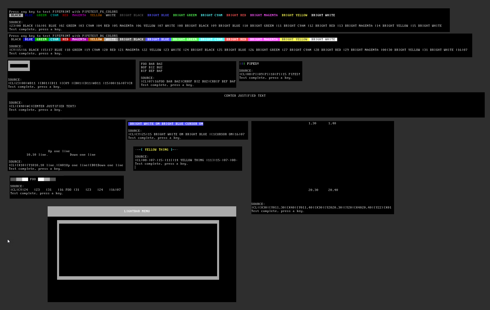

# [QB64_GJ_LIB](../README.md)
## GRYMMJACK'S PIPEPRINT LIBRARY

> Pipe (`|`) Print emulates [Mystic BBS Display codes](http://wiki.mysticbbs.com/doku.php?id=displaycodes) (pipe codes) parsing


## WHAT'S IN THE LIBRARY
| SUB / FUNCTION | NOTES |
|----------------|-------|
| PIPEPRINT$ | Parses pipe codes and returns ANSI (can emulate ANSI via QB) |
| PIPESTRIP$ | Strips all pipe codes from a string |


## PIPEPRINT SYNTAX / CODES
| Pipe Code | Description |
|-----------|-------------|
| `\|[0` | Hide Cursor |
| `\|[1` | Show Cursor |
| `\|[K` | Clear from cursor to EOL |
| `\|CL` | Clear the screen |
| `\|CN` | Turns iCE Colors Off (`_BLINK OFF`) |
| `\|CY` | Turns iCE Colors On (`_BLINK ON`) |
| `\|CR` | Creates a CR/LF |
| `\|PI` | Creates a literal `\|` pipe symbol |
| `\|[Xnn` | Goto column nn (0 padded) |
| `\|[Ynn` | Goto row nn (0 padded) |
| `\|[Ann` | Move up nn rows (0 padded) |
| `\|[Bnn` | Move down nn rows (0 padded) | 
| `\|[Cnn` | Move right nn columns (0 padded) |
| `\|[Dnn` | Move left nn columns (0 padded) |
| `\|@R{stuff}` | Right justify text on line|
| `\|@L{stuff}` | Left justify text on line|
| `\|@C{stuff}` | Center text on line|
| `\|@DnnX` | Duplicate X nn times |
| `\|@D00X` | Duplicate X as many times as the display is wide |

## PIPEPRINT FOREGROUND COLORS
| Pipe Code | Description |
|-----------|-------------|
| `\|00` | Black |
| `\|01` | Blue |
| `\|02` | Green |
| `\|03` | Cyan |
| `\|04` | Red |
| `\|05` | Magenta |
| `\|06` | Yellow |
| `\|07` | White |
| `\|08` | Bright Black |
| `\|09` | Bright Blue |
| `\|10` | Bright Green |
| `\|11` | Bright Cyan |
| `\|12` | Bright Red |
| `\|13` | Bright Magenta |
| `\|14` | Bright Yellow |
| `\|15` | Bright White |

## PIPEPRINT BACKGROUND COLORS
| Pipe Code | Description |
|-----------|-------------|
| `\|16` | Black |
| `\|17` | Blue |
| `\|18` | Green |
| `\|19` | Cyan |
| `\|20` | Red |
| `\|21` | Magenta |
| `\|22` | Yellow |
| `\|23` | White |

## PIPEPRINT BACKGROUND COLORS (iCE)
| Pipe Code | Description |
|-----------|-------------|
| `\|24` | Bright Black |
| `\|25` | Bright Blue |
| `\|26` | Bright Green |
| `\|27` | Bright Cyan |
| `\|28` | Bright Red |
| `\|29` | Bright Magenta |
| `\|30` | Bright Yellow |
| `\|31` | Bright White |


### USAGE for PIPEPRINT LIB (separately)
```basic
'Insert at top of code:
'$INCLUDE:'path_to_GJ_LIB/PIPEPRINT/PIPEPRINT.BI'

'...your code here...

'Insert at bottom of code:
'$INCLUDE:'path_to_GJ_LIB/PIPEPRINT/PIPEPRINT.BM'
```


### EXAMPLE 
> Screenshot of output from [PIPEPRINT.BAS](PIPEPRINT.BAS)


