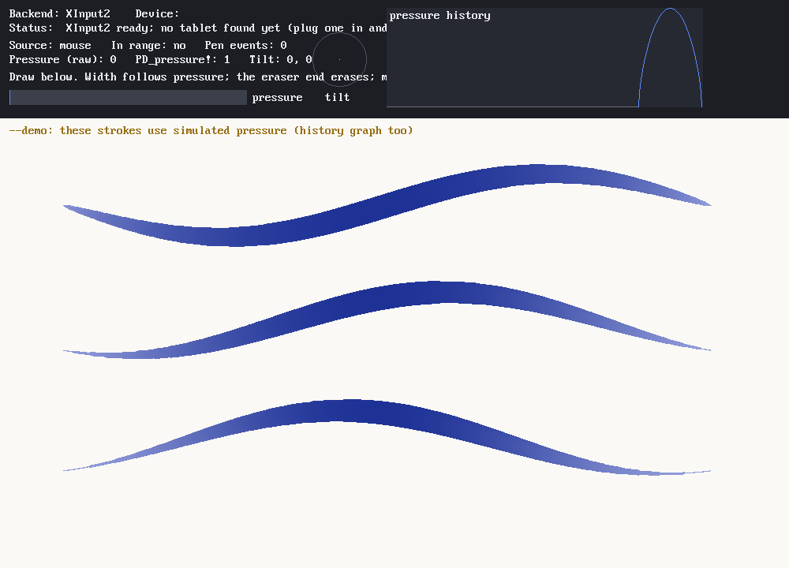
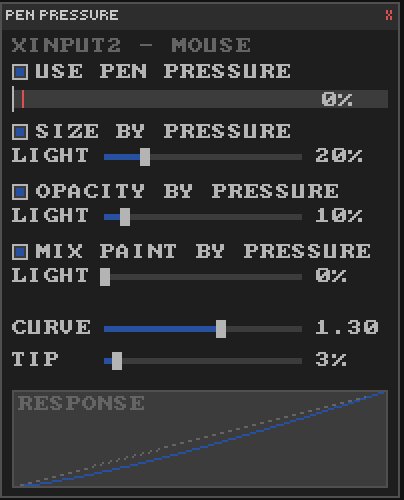

# QB64_GJ_LIB PRESSURE_DEVICE

Pen pressure for QB64-PE programs on Windows, macOS and Linux.

QB64-PE draws its window with GLFW. Neither GLFW nor QB64-PE has any pen or
tablet support, so a pen normally reaches a QB64-PE program as a plain mouse.
This library hooks the program's **native window** (`_WINDOWHANDLE` returns it on
every platform) and reports what the pen is doing:

- **Pressure**, 0..1.
- **Tilt**, on both axes.
- **Which end is in use**: pen tip or eraser.
- **Whether the pen is in range**: hovering over or touching the window.
- **Force Touch trackpad** click pressure, on macOS.

A mouse keeps working exactly as before: it reports pressure 1.



*`PRESSURE_DEVICE-TEST --demo` under Xvfb. The strokes and the history graph use
simulated pressure, because a screenshot machine has no tablet. With a real pen
the panel also shows the device name, `Source: pen` and a moving pressure bar.*

## Quick start

```basic
'$INCLUDE:'PRESSURE_DEVICE/PRESSURE_DEVICE.BI'
SCREEN _NEWIMAGE(800, 600, 32)
IF PD_init% THEN _TITLE "pen backend: " + PD_backend_name$   ' after SCREEN
DO
    PD_poll                                   ' once per frame, before reading
    DO WHILE _MOUSEINPUT
        IF _MOUSEBUTTON(1) THEN
            r! = 0.5 + PD_pressure! * 10      ' 0..1 for a pen, 1 for a mouse
            CIRCLE (_MOUSEX, _MOUSEY), r!
        END IF
    LOOP
LOOP UNTIL _KEYHIT = 27
PD_shutdown
'$INCLUDE:'PRESSURE_DEVICE/PRESSURE_DEVICE.BM'
```

`PRESSURE_DEVICE-EXAMPLE.BAS` is this program, complete and ready to compile. No
compiler flags or extra libraries are needed; the C++ header is compiled inline
through `DECLARE LIBRARY`.

## Setting up a tablet

| OS | What you need |
|---|---|
| **Windows** 8 or later | The tablet maker's driver, with **Windows Ink** turned on in its pen settings. Windows Ink is how pressure reaches programs, and it is on by default for Huion and most others. For Wacom it is *Mapping → Use Windows Ink*. |
| **macOS** | The tablet maker's driver, **with its tablet app running** (for Huion, the menu-bar app). Allow the driver under System Settings → Privacy & Security → Accessibility (and Input Monitoring, if it is listed). Without the app, the pen moves the cursor but reports no pressure. |
| **Linux** (X11 or Wayland) | Usually nothing: the kernel supports most tablets, and Wayland desktops pass them through XWayland as `xwayland-tablet …` devices. The maker's Linux driver works too. `xinput list` shows the pen device if X sees it. |

## Tested hardware

| Platform | Tablet | Result |
|---|---|---|
| Linux, Wayland (XWayland) | HUION Inspiroy 2 M | ✅ Works, with the system's own tablet support and with Huion's driver. |
| macOS | HUION Inspiroy 2 M | ✅ Works, with Huion's driver and tablet app. |
| Windows | HUION Inspiroy 2 M | ✅ Works, with Huion's driver and Windows Ink on. |
| Linux, X11 (Xvfb) | none | The backend starts, and hover and click events still reach the program. |

The Wacom eraser end, tilt, and Force Touch trackpads are implemented, but none
has been confirmed on hardware yet (the Inspiroy pen has no eraser or tilt).
Reports are welcome.

## API

| Routine | Returns |
|---|---|
| `PD_init%` | TRUE when a backend started. Call it after `SCREEN`. Safe to call again. |
| `PD_poll` | Collects pending pen events. Call it once per frame, before reading values. |
| `PD_pressure!` | Pressure to draw with: the pen's 0..1, or **1 for a mouse** or when there is no backend. |
| `PD_raw_pressure!` | The last pen pressure, whatever the current pointer is. |
| `PD_source%` | `PD_SRC_MOUSE`, `PD_SRC_PEN`, `PD_SRC_ERASER` or `PD_SRC_TRACKPAD`: what produced the last pointer event. |
| `PD_source_name$(src)` | `"mouse"`, `"pen"`, `"eraser"`, `"pressure trackpad"`. |
| `PD_is_pen%`, `PD_is_eraser%` | Shortcuts for the source. |
| `PD_tilt_x!`, `PD_tilt_y!` | -1..1, where 0 is upright. 0 when the device has no tilt. |
| `PD_in_range%` | Whether the pen is in range of the window, where the OS reports it. |
| `PD_backend%`, `PD_backend_name$` | `PD_BACKEND_NONE` / `_WINDOWS` / `_MACOS` / `_XINPUT2`, and its name. |
| `PD_status$` | What `PD_init%` did, in words. Show it when `PD_init%` returns FALSE. |
| `PD_device$` | The pen device's name. Linux reports the driver's name. |
| `PD_events&` | Count of pen events received, for diagnostics. |
| `PD_curve!(p, gamma)` | Shapes a pressure value. Gamma < 1 makes light touches count more; > 1 means pressing harder. |
| `PD_shutdown` | Stops the backend. |

## Tips for drawing programs

These come from adding pressure to [DRAW](https://github.com/grymmjack/DRAW). See
its `INPUT/PEN.BM` and `GUI/PEN-PANEL.BM`.

- **Interpolate pressure along a stroke.** Pressure arrives once per frame, so a
  fast stroke would change width in visible steps. Read it once per frame, then
  blend from the previous reading to the new one across the dabs of that
  segment.
- **Add a tip threshold.** A pen that only grazes the tablet can register as a
  click at almost no pressure. That leaves stray dots along the hover path.
  Ignore contact until pressure passes a small threshold (DRAW defaults to 3%),
  and record no undo step for a stroke that never passed it.
- **Filter landing and lift-off.** Pressure reaches 0 a moment before the button
  releases, and only rises a moment after it presses. Holding the last real
  value for readings below ~2% avoids a blob at the start of a stroke and a
  hairline flick at the end.
- **Don't let dabs compound.** If pressure drives opacity, keep the strongest
  opacity reached at each pixel during a stroke and composite from a
  stroke-start snapshot. Overlapping dabs then never build up.
- **Let the user tune it.** Expose a pressure curve (`PD_curve!`) and a value for
  the lightest touch. DRAW's Pen Pressure panel shows a live meter and a
  response graph:

  

## How it works

The native layer is `pressure_device.h`. `PRESSURE_DEVICE.BI` declares it, and
`PRESSURE_DEVICE.BM` wraps it in the `PD_` API.

### Windows: Windows Ink pointer messages

The window procedure is subclassed with `SetWindowLongPtrW`. `WM_POINTERUPDATE`,
`DOWN`, `UP`, `ENTER` and `LEAVE` messages from a pen go through
`GetPointerPenInfo`:
- pressure 0..1024 is scaled to 0..1;
- tilt is ±90° scaled to ±1;
- the eraser comes from the `PEN_FLAG_ERASER` and `PEN_FLAG_INVERTED` flags.

Every message is passed on unchanged with `CallWindowProcW`, so QB64-PE still
sees the mouse. The pointer API is loaded with `GetProcAddress`, so the program
also runs on systems without it; it just reports no backend there.

### macOS: an `NSWindow sendEvent:` override

The library uses the Objective-C runtime (reached with `dlsym`, so there are no
link flags or `.mm` files). It adds a `sendEvent:` override to the window's class
that records pen state, then calls the original:
- **Pressure and tilt** come from tablet-subtype mouse events and tablet-point
  events.
- **Proximity events** say whether the tip or the eraser is in use.
- **Force Touch trackpads** send `NSEventTypePressure`.

### Linux: XInput2 raw motion

The library opens a second X connection (`libX11` and `libXi` loaded with
`dlopen`, with the minimal Xlib types declared in a namespace so no X11 macros
leak into the program). On the root window it selects `XI_RawMotion`, plus
`XI_HierarchyChanged` for hotplug.
- **Finding tools:** tablet tools are slave pointers with an `Abs Pressure` axis.
  XWayland's unlabelled `stylus` / `eraser` devices are matched by name instead.
- **Tilt:** read from `Abs Tilt X/Y`.
- **Event data:** raw events carry the device in `deviceid`, not `sourceid`
  (`sourceid` is always 0, an X server bug), and the master pointer's duplicate
  copies are skipped.

**Why raw events on the root window?** Selecting `XI_Motion` on the program's own
window makes the X server deliver motion there to *this* connection as XI2
*instead of* sending core `MotionNotify` to GLFW. The program would lose hover
movement; dragging keeps working only because a held button routes events
through an implicit grab. Raw events go to every client that asks for them, and
take nothing away.

## Testing

| File | What it does |
|---|---|
| `PRESSURE_DEVICE-TEST.BAS` | Live readout of every value, a pressure history graph, and a canvas where stroke width follows pressure and the eraser end erases. `--selftest` prints the backend status to the console and exits 0 when a backend is running. `--demo` pre-draws strokes with simulated pressure, for screenshots. |
| `PRESSURE_DEVICE-EXAMPLE.BAS` | The quick-start program above. |
| `PRESSURE_DEVICE-XI2-TEST.cpp` | Unit test for the Linux backend's event parsing, with no X server needed: `g++ -std=c++17 PRESSURE_DEVICE-XI2-TEST.cpp -o xi2test -ldl && ./xi2test`. It feeds simulated raw XInput2 events and checks pressure scaling, tilt, sparse axis data, the eraser, pen/mouse switching, that the master pointer's copies are skipped, and that rescans happen on hotplug only. |

To test with a tablet:
```bash
cd PRESSURE_DEVICE
qb64pe -w -x PRESSURE_DEVICE-TEST.BAS -o "$PWD/pdtest"
./pdtest --selftest      # backend + status line
./pdtest                 # then draw with the pen
```

## Troubleshooting

| Symptom | Fix |
|---|---|
| `Source` stays `mouse`, pressure flat (Windows) | Turn on **Windows Ink** in the tablet driver's pen settings. |
| Pen moves the cursor but no pressure (macOS) | Install the maker's driver, keep its tablet app running, and allow it under Accessibility / Input Monitoring. |
| `no tablet found yet` (Linux) | Check `xinput list` for a pen or stylus device. If there is none, install the maker's driver. `xinput test-xi2 --root` shows the raw axes the pen sends. |
| Stray dots while hovering | The pen grazes the tablet and registers clicks. Use a tip threshold (see the tips above), or raise the click sensitivity in the tablet driver. |

(c) 2026 grymmjack — MIT License
