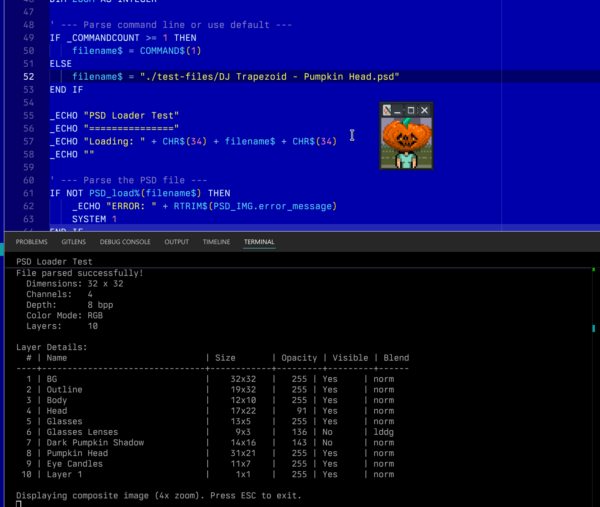

# [QB64_GJ_LIB](../README.md)
## GRYMMJACK'S PSD LIBRARY

Adds native [Adobe Photoshop PSD](https://www.adobe.com/devnet-apps/photoshop/fileformatashtml/) support to QB64-PE with full layer parsing.

### USAGE for PSD LIB (separately)
```basic
'Insert at top of file:
'$INCLUDE:'path_to_GJ_LIB/PSD/PSD.BI'

' ...your code here...

'Insert at bottom of file:
'$INCLUDE:'path_to_GJ_LIB/PSD/PSD.BM'
```

## SUPPORTED FEATURES
- PSD version 1 (not PSB)
- 8-bit depth, RGB and Grayscale color modes
- Raw, RLE (PackBits), and ZIP compression
- Layer names (Pascal string + Unicode `luni` override)
- Layer bounds, opacity (0-255), visibility, blend modes
- Group/folder layer detection and skipping
- Flat-composite fallback for PSDs without layer data

## WHAT'S IN THE LIBRARY
| SUB / FUNCTION | NOTES |
|----------------|-------|
| PSD_load% | Parse a PSD file and populate layer metadata (PSD_IMG, PSD_LAYERS). Returns TRUE on success. |
| PSD_get_layer_image& | Extract pixel data for a single layer, returning a 32-bit RGBA image handle. |
| PSD_map_blend_mode% | Map a PSD 4-char blend mode key to a DRAW BLEND_* constant. |
| PSD_read_u16& | Read a 2-byte big-endian unsigned integer from file. |
| PSD_read_i16% | Read a 2-byte big-endian signed integer from file. |
| PSD_read_u32&& | Read a 4-byte big-endian unsigned integer from file. |
| PSD_read_i32& | Read a 4-byte big-endian signed integer from file. |
| PSD_decode_packbits$ | Decode PackBits RLE-compressed data. |

## BLEND MODE MAPPING
| PSD Key | PSD Mode | DRAW Equivalent |
|---------|----------|-----------------|
| `norm` | Normal | BLEND_NORMAL |
| `mul ` | Multiply | BLEND_MULTIPLY |
| `scrn` | Screen | BLEND_SCREEN |
| `over` | Overlay | BLEND_OVERLAY |
| `dark` | Darken | BLEND_DARKEN |
| `lite` | Lighten | BLEND_LIGHTEN |
| `div ` | Color Dodge | BLEND_COLOR_DODGE |
| `idiv` | Color Burn | BLEND_COLOR_BURN |
| `hLit` | Hard Light | BLEND_HARD_LIGHT |
| `sLit` | Soft Light | BLEND_SOFT_LIGHT |
| `diff` | Difference | BLEND_DIFFERENCE |
| `smud` | Exclusion | BLEND_EXCLUSION |
| `vLit` | Vivid Light | BLEND_VIVID_LIGHT |
| `lLit` | Linear Light | BLEND_LINEAR_LIGHT |
| `pLit` | Pin Light | BLEND_PIN_LIGHT |
| `colr` | Color | BLEND_COLOR |
| `lum ` | Luminosity | BLEND_LUMINOSITY |
| `lddg` | Linear Dodge (Add) | BLEND_ADD |
| `lbrn` | Linear Burn | BLEND_COLOR_BURN |
| `fsub` | Subtract | BLEND_SUBTRACT |
| `pass` | Pass Through | BLEND_NORMAL |

### SAMPLE PROGRAMS
- [PSD.BAS](PSD.BAS) - Simple implementation to load a `.psd` file and display layer info

### SCREENSHOT


## TODO
- [ ] 16-bit and 32-bit depth support
- [ ] CMYK color mode support
- [ ] ZIP with prediction decompression
- [ ] PSB (large document) support
- [ ] Layer mask support
