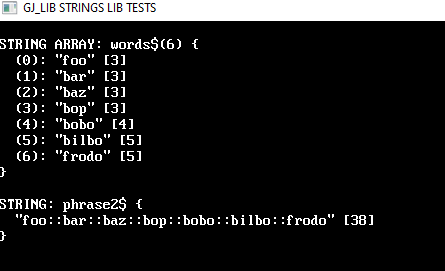

# QB64_GJ_LIB 
## GRYMMJACK'S STRINGS LIBRARY

> Some commonly used functions that I missed in QB64 coming from PHP.

## WHAT'S IN THE LIBRARY
| SUB / FUNCTION | NOTES |
|----------------|-------|
| str_implode$  | Implodes a string array into a string using delimiter as glue |
| str_explode   | Explodes a string into an array of strings using a delimiter |
| str_find_pos  | Searches for strings in strings, fills array of found positions |


### USAGE for STRINGS LIB (separately)
```basic
'Insert at top of code:
'$INCLUDE:'path_to_GJ_LIB/STRINGS/STRINGS.BI'

'...your code here...

'Insert at bottom of code:
'$INCLUDE:'path_to_GJ_LIB/STRINGS/STRINGS.BM'
```


### EXAMPLE 
> Screenshot of output from [STRINGS.BAS](STRINGS.BAS)

