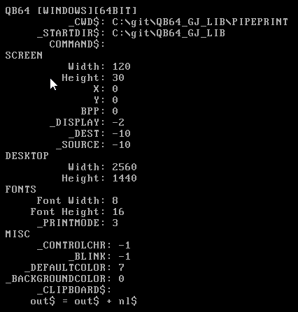

# [QB64_GJ_LIB](../README.md) 
## GRYMMJACK'S SYS LIBRARY

> Contains misc. helpful utils/tools


## WHAT'S IN THE LIBRARY
| SUB / FUNCTION | NOTES |
|----------------|-------|
| open_url_in_browser | Opens the default web browser with a URL on all operating systems |
| sys_info$ | Get system information as a big string |
| device_info$ | Get device information as a big string |
| console_setup | Sets up console in a cross-platform way |


### USAGE for SYS LIB (separately)
```basic
'Insert at top of code:
'$INCLUDE:'path_to_GJ_LIB/SYS/SYS.BI'

'...your code here...

'Insert at bottom of code:
'$INCLUDE:'path_to_GJ_LIB/SYS/SYS.BM'
```


### EXAMPLE 
> Screenshot of output from [SYS.BAS](SYS.BAS)


