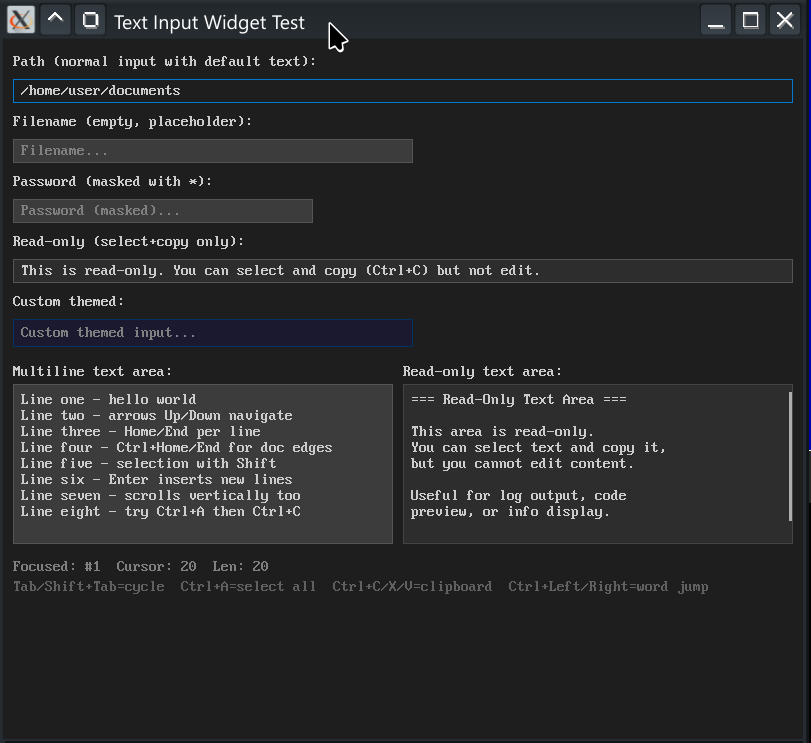
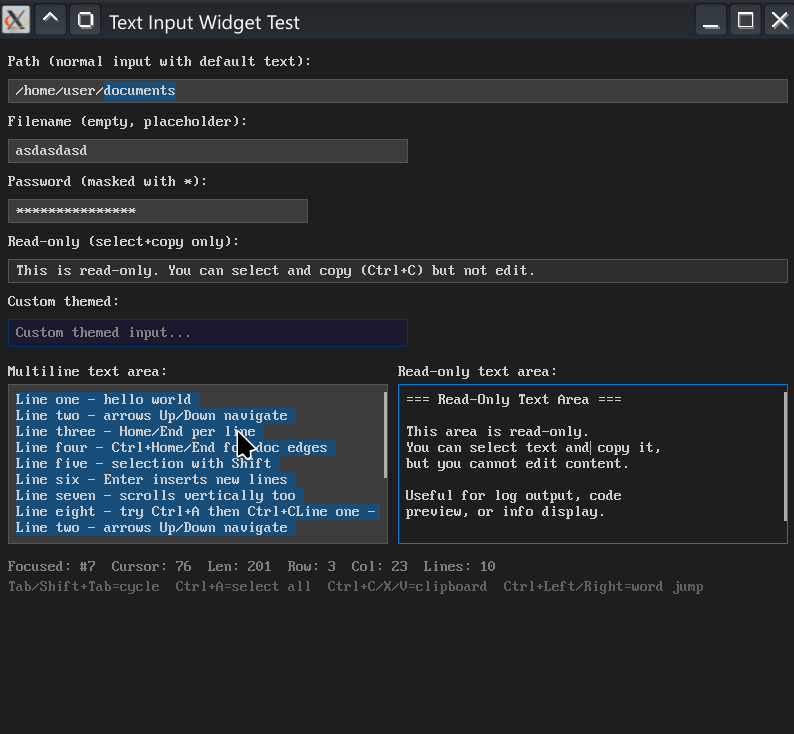

# TEXT_INPUT — Reusable Text Input Widget




> Single-line and multiline text input widget for QB64-PE. Foundation for MSG_BOX, COLOR_PICKER, and FILE_DIALOG.

## Features

- Up to 16 simultaneous input instances
- 4096 character max per input
- Mouse click, double-click (word select), triple-click (line), quad-click (all)
- Keyboard: Home/End, Ctrl+Left/Right (word jump), arrow keys
- Clipboard: Ctrl+C/X/V/A
- Undo/Redo: Ctrl+Z / Ctrl+Shift+Z / Ctrl+Y (grouped by typing bursts)
- Cursor blinking, text scrolling, placeholder text
- Password masking mode
- Read-only mode
- Per-instance theme overrides (9 colors)
- Multiline support with word wrap, vertical scrolling, scrollbar indicator
- Tab/Shift+Tab focus cycling (callback hints)

## Dependencies

None — fully self-contained.

## Usage

```basic
'$INCLUDE:'path/to/TEXT_INPUT/TEXT-INPUT.BI'

' ... your code ...

DIM myInput AS INTEGER
myInput = TI_create%(10, 40, 300, 24)
TI_inputs(myInput).placeholder = "Type here..."
TI_set_focus myInput

' In your main loop:
DO
    k = _KEYHIT
    IF k <> 0 THEN TI_process_key% k
    ' Handle mouse clicks:
    IF mouseJustPressed THEN TI_process_mouse _MOUSEX, _MOUSEY, -1
    TI_tick  ' cursor blink
    TI_render myInput, 0, 0
    _DISPLAY
    _LIMIT 60
LOOP

TI_destroy myInput

'$INCLUDE:'path/to/TEXT_INPUT/TEXT-INPUT.BM'
```

## Files

| File | Purpose |
|------|---------|
| `TEXT-INPUT.BI` | Leader include (types + constants) |
| `TEXT-INPUT.BM` | Leader implementation (input + render) |
| `TI-TYPES.BI` | Type definitions, constants, shared state |
| `TI-INPUT.BM` | Keyboard/mouse input, clipboard, undo/redo |
| `TI-RENDER.BM` | Single-line and multiline rendering |
| `TI-TEST.BAS` | Standalone test program |

## API

| Function/Sub | Description |
|-------------|-------------|
| `TI_create%(x, y, w, h)` | Create input, returns ID (0 on fail) |
| `TI_destroy(id)` | Free an input slot |
| `TI_set_text(id, txt$)` | Set text content |
| `TI_get_text$(id)` | Get text content (trimmed) |
| `TI_set_focus(id)` | Give focus to input |
| `TI_clear_focus` | Remove focus from all |
| `TI_process_key%(k&)` | Process _KEYHIT value |
| `TI_process_mouse(px, py, justPressed)` | Handle mouse click |
| `TI_process_mousewheel(px, py, dir)` | Handle scroll wheel |
| `TI_tick` | Update cursor blink |
| `TI_render(id, offsetX, offsetY)` | Draw one input |
| `TI_render_all(offsetX, offsetY)` | Draw all active inputs |
| `TI_set_geometry(id, x, y, w, h)` | Update position/size |
| `TI_hit_test%(px, py)` | Returns input ID at point |

## Author

grymmjack (Rick Christy) — MIT License
